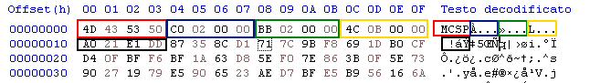

# Encrypted Object
An encrypted object is an internal file format used to encrypt and compress
any raw file data

It is currently used in the following files:

 - Item Proto
 - Mob Proto
 - EterPack Index
 - EterPack Content (type 2 and 6)

The format consists in a header with 20 bytes followed by the data
(either encrypted or compressed)

A Kaitai structure file for reading the format is available
[here](https://metin2.dev/bin/?f3421ddb59ca59b1#6vPviQ8fcQn5gtALBfeqFoxA82w9tAScZbXVbziM45mF)

## Header

| Color                                     | Bytes | Description                               |
|-------------------------------------------|-------|-------------------------------------------|
| Red        | 4     | Magic code that specifies the object type |
| Blue | 4     | Data size after being encrypted           |
| Green    | 4     | Data size after being compressed          |
| Yellow  | 4     | Data size before being encrypted          |
| Black     | 4     | Encrypted/Raw Magic Code                  |

## Data Compression

The data is compressed by with one of the following algorithms
depending on which Magic code is specified

### Known Compression Algorithms

| Magic Code | Algorithm |
|------------|-----------|
| MCOZ       | LZO 1x    |
| MCSP       | Snappy    |

## Data Encryption

The data is encrypted with the XTEA algorithm, so to decrypt it
is required a specific key for decrypting, a list of known keys follows below

### Knowing if the data is encrypted

If the bytes in Blue are >= 0 
and the bytes in Red are different from
the bytes in Black,
then the data is encrypted, meaning the bytes in Black
correspond to the Magic used to check if XTEA decryption was successful

Otherwise, the bytes in Black will be
equal to the bytes in Red

### Known XTEA keys
| Used In          | Key (16 bytes)                                   |
|------------------|--------------------------------------------------|
| Item Proto       | 	A1 A4 02 00 AA 15 54 04 E7 8B 5A 18 AB D6 AA 01 |
| Mob Proto        | 	46 74 49 00 0B 4A 00 00 B7 6E 08 00 9D 18 68 00 |
| EterPack Index   | 	B9 9E B0 02 6F 69 81 05 63 98 9B 28 79 18 1A 00 |
| EterPack Content | 	22 B8 B4 04 64 B2 6E 1F AE EA 18 00 A6 F6 FB 1C |
