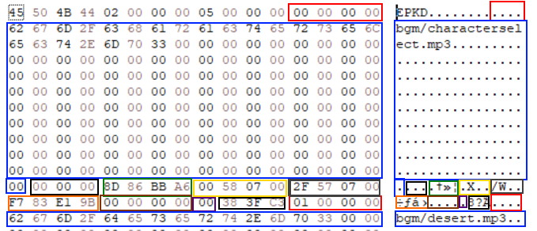

# EterPack

The EterPack is a proprietary Virtual File System used for containing all the Client assets
(such as 3d meshes, sfx, textures).

An EterPack consists of two files, the Index file (.eix) and the Content file (.epk)

The Content file is where the files are stored, either encrypted
or decrypted, while the Index file is where all information
of the files are stored.
(An information might be the file's compression type or the directory
where it should virtually mapped)

Index files are usually encrypted as a Crypted Object, therefore before
reading the header, the client must decrypt the file following
the method described in the Crypted Object page.

## Formats

### Index (.eix extension)

#### Header ( 16 bytes )

| Color                                     | Bytes | Description                                                         |
|-------------------------------------------|-------|---------------------------------------------------------------------|
| Red        | 4     | FourCC (EPKD)                                                       |
| Blue | 4     | Version (Must be 2, it is not known if a EPK with version 1 exists) |
| Green    | 4     | Amount of files in the content                                      |
| Yellow  | 4     | Start of the file index information                                 |

From the number of files included in this EterPack, it follows one or more "Index File Information" or simply File information.

#### File Information ( 193 bytes )

| Color                                     | Bytes   | Description                          |
|-------------------------------------------|---------|--------------------------------------|
| Red        | 4       | Id                                   |
| Blue | 160 + 1 | File name (ASCII) + Null terminator  |
| Black     | 3       | Padding                              |
| Green    | 3       | File name CRC32                      |
| Yellow  | 4       | Decompressed and decrypted file size |
| Gray      | 4       | Packed file size in the Content      |
| Orange  | 4       | Packed file CRC32 in the Content     |
| Brown    | 4       | Packed file offset in the Content    |
| Purple  | 4       | Encryption type                      |
| Black     | 2       | Padding                              |

### Content (.epk extension)

A Content file (.epk) contains the data encrypted by the specified
algorithm type, there is no header or any format in this file,
they are raw files which can be mapped by information that comes
from the Index information specified above

#### Algorithm Types

| Type | Name                                                            | Description                                                                                                   |
|------|-----------------------------------------------------------------|---------------------------------------------------------------------------------------------------------------|
| 0    | Raw                                                             | No compression or encryption                                                                                  |
| 1    | LZO                                                             | Compressed with LZO                                                                                           |
| 2    | LZO+XTEA                                                        | Compressed with LZO then encrypted with XTEA                                                                  | 
| 3    | Panama                                                          | Encrypted with Panama                                                                                         |
| 4    | [HybridCrypt](../../Encryption/hybrid_cript.md)       | HybridCrypt                                                                                                   |
| 5    | [HybridCrypt+](../../Encryption/hybrid_cript_plus.md) | HybridCrypt with extra data                                                                                   |
| 6    | Snappy+XTEA                                                     | Compressed with Snappy then encrypted with XTEA using the Content keys (In other words, a MCSP CryptedObject) |

## Deployment

All the packs are stored inside the pack/ folder of the 
game client, and they are loaded in a specified order defined by
the Pack `Index` that's also present in that same folder

