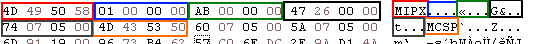

# Item Proto

The Item Proto is a crypted file that contains all informations
about the items included in the game. This file is both present in the
client and the server.

In the server, this file is used to process all the item 
(such as when you equip an item, if you can actually equip it).

In the client, this file is used to perform several client-side
checks (in order to reduce the amount of data sent to the server) 
and what actually is displayed in the item information.

The Item proto must be in one of this two formats, MIPX format or MIPT format.

## Deployment

Although the client is able to load a MIPT Item Proto (as references exists in the binary), no MIPT proto has ever been found.

## Composition

### MIPX format

#### Header (16 bytes)

| Color                                     | Bytes | Description              |
|-------------------------------------------|-------|--------------------------|
| Red        | 4     | FourCC (MIPT)            |
| Blue | 4     | Version                  |
| Green    | 4     | Item table size          |
| Orange  | 4     | Amount of elements       |
| Black     | 4     | Size of Crypted Object   |
| Gray      | 4     | Offset of Crypted Object |

### MIPT format

While references of this file format still exists in the 
executable, no public client that ships a MIPT proto has
ever surfaced.

It might have been used during development of Metin2 or in very old
clients (like 2004 or 2003).

The CryptedObject format is the same as a MIPX proto.

#### Header (16 bytes)

| Color                                     | Bytes | Description            |
|-------------------------------------------|-------|------------------------|
| Red        | 4     | FourCC (MIPT)          |
| Blue | 4     | Amount of records      |
| Gray      | 4     | Size of Crypted Object |
| Orange  | 4     | Crypted Object offset  |

#### Item table (163 bytes)

| Name                    | Type     | Size (in bytes) | Description                                                                                                    |
|-------------------------|----------|-----------------|----------------------------------------------------------------------------------------------------------------|
| id                      | uint32   | 4               | Number of the item (ie. Sword+0 = 10)                                                                          |
| range                   | uint32   | 4               | The range is used to associate a certain item id range to one item in the item proto table.                    |
| index_name              | char[25] | 25              | Internally used in the game (such as in parsing server side tables)                                            |
| locale_name             | char[25] | 25              | Actual name displayed in the client or in quests                                                               |
| type                    | uint8    | 1               | Type of the item, see List of known Item types                                                                 |
| subtype                 | uint8    | 1               | Extra information which tells the item what it is based from the item type, see List of known Item types       |
| weight                  | uint8    | 1               | Unused                                                                                                         |
| size                    | uint8    | 1               | How many cells does the item take                                                                              |
| anti_flags              | uint32   | 4               | Bitflag that defines what you can't do without the item, see List of known Item flags                          |
| flags                   | uint32   | 4               | Bitflag that defines extra informations in what the item can be used for, see List of known Item flags         |
| wear_flags              | uint32   | 4               | Bitflag that defines where you can equip the item, see List of known Item flags                                |
| immune_flags            | uint32   | 4               | Unused                                                                                                         |
| buy_price               | uint32   | 4               | Price that you can buy the item                                                                                |
| sell_price              | uint32   | 4               | Price that you can sell the item                                                                               |
| limits                  | Limit[2] | ?               | Limits certain usage of the item (Time expire for example)                                                     |
| applies                 | Apply[2] | ?               | Standard bonuses that the item have                                                                            |
| values                  | int32[6] | ?               | The usage of values vary from the type of item                                                                 |
| sockets                 | int32[3] | ?               | The usage of sockets vary from the type of item                                                                |
| refine_item_id          | uint32   | 4               | ID of the item that will evolve once it's refined (example: from Sword+0 to Sword+1, refineditemid will be 11) |
| refine_set              | uint16   | 2               | Unused                                                                                                         |
| alter_magic_value       | uint8    | 1               | Unused                                                                                                         |
| specular                | uint8    | 1               | Sets the intensity of how the item will shine (The effect that +9 weapons have)                                |
| alter_socket_percentage | uint8    | 1               | Unused                                                                                                         |

##### Limit / Applies

| Name  | Type   | Size (in bytes) | Description      |
|-------|--------|-----------------|------------------|
| type  | uint8  | 1               | Attribute number |
| value | uint32 | 4               | Attribute value  |

