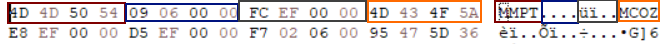

# Mob Proto

## Summary
The Mob Proto is a crypted file that contains all informations about
the monsters and NPCs included in the game.

This file is present both in the client and the server.

In the server, this file is used to process the mob information 
(such as damage)

In the client, this file is used to perform several client-side checks
(in order to reduce the amount of data sent to the server) and what 
actually is displayed in the item information, another example 
if the mob directory.

The Mob Proto contains only one format (MMPT), which is then crypted as
a Crypted Object

## Composition

### MMPT format

| Color                                     | Bytes | Description            |
|-------------------------------------------|-------|------------------------|
| Red        | 4     | FourCC (MMPT)          |
| Blue | 4     | Amount of elements     |
| Gray      | 4     | Size of Crypted Object |
| Orange  | 4     | Crypted Object offset  |

